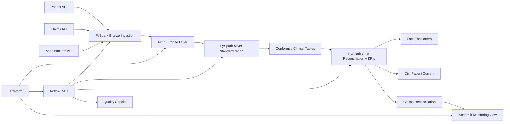

# Healthcare Data Pipeline

Healthcare analytics pipeline focused on governed domain modeling, reconciliation, and trust in clinical
reporting outputs. This repo is intentionally shaped like work owned by a data engineer who has to make
encounters, claims, and patient dimensions analytically reliable rather than just technically runnable.

## What This Project Actually Optimizes For

- Reconciliation between operational encounters and adjudicated claims.
- Patient-centric dimensional outputs that reduce duplicate business logic across teams.
- Data quality rules that reflect healthcare reporting risk, not just generic null checks.
- Azure-native orchestration and deployment patterns for a governed analytics platform.
- A lightweight dashboard used to expose reconciliation and data quality posture, not replace the warehouse.

## Domain Focus

Healthcare data platforms get difficult when records that should represent the same event do not arrive at
the same time or with the same semantics. This repository centers on that problem:

- appointment data reflects operational scheduling,
- claims data reflects financial adjudication,
- not every encounter has a matching claim yet,
- not every claim should be treated as reportable revenue immediately,
- patient-level reporting needs curated, reusable definitions.

## Architecture



## Why This Feels Senior

- It treats data correctness as a domain problem, not just a parsing problem.
- It explicitly models encounter-to-claim coverage, which is the kind of gap stakeholders actually ask about.
- It publishes patient-centric outputs and reconciliation outputs separately because they serve different consumers.
- It uses the UI to surface trust signals instead of pretending the dashboard is the platform.

## Repository Layout

- `src/healthcare_data_pipeline/`: Shared Python code, PySpark-style jobs, reconciliation logic, KPI logic, and runtime config.
- `dags/`: Airflow DAG for orchestration.
- `infrastructure/terraform/`: Terraform for Azure storage, secrets, monitoring, and app hosting primitives.
- `docs/`: Architecture and deployment notes.
- `.github/workflows/`: CI checks.
- `tests/`: Unit tests covering core pipeline helpers and quality rules.
- `data/sample/bronze/`: Sample healthcare source data for a local demo pipeline run.
- `data/demo_output/`: Generated Silver, Gold, reconciliation, and quality outputs after running the demo pipeline.

## Implemented Stack Mapping

| Resume technology | Implemented in repo |
| --- | --- |
| Azure | ADLS Gen2-style storage, Key Vault, managed identity, role assignments, App Service, and resource group in Terraform |
| PySpark | Bronze ingestion, Silver normalization, Gold dimensional modeling, and reconciliation helpers |
| Airflow | Daily DAG orchestrating Azure Databricks-style Bronze/Silver/Gold execution and quality publication |
| Governance | Encounter-to-claim reconciliation plus patient-centric reusable analytics outputs |
| Streamlit | Monitoring view for payer mix, reconciliation posture, and quality status |

## Quick Start

1. Create a virtual environment and install local tooling:

   ```powershell
   python -m venv .venv
   .\.venv\Scripts\Activate.ps1
   pip install -e .[dev]
   ```

2. Copy environment variables:

   ```powershell
   Copy-Item .env.example .env
   ```

3. Run local validation:

   ```powershell
   python -m pytest
   python -m ruff check . --no-cache
   ```

4. Review Azure deployment inputs:

   ```powershell
   Copy-Item infrastructure/terraform/terraform.tfvars.example infrastructure/terraform/terraform.tfvars
   ```

5. Start the dashboard locally:

   ```powershell
   python -m healthcare_data_pipeline.demo_pipeline
   streamlit run streamlit_app.py
   ```

## Demo Run

If you want a fast local walkthrough without live Azure services:

   ```powershell
   python -m healthcare_data_pipeline.demo_pipeline
   ```

This writes generated outputs under `data/demo_output/`:

- `silver/patients.json`, `silver/claims.json`, `silver/appointments.json`
- `gold/dim_date.json`, `gold/dim_patient_current.json`, `gold/fact_encounters.json`, `gold/kpi_metrics.json`
- `gold/claims_reconciliation.json`
- `quality/quality_results.json`

The Streamlit app automatically reads those files when present.

## Local Development Notes

- Python 3.11+ is the local development baseline.
- The ETL modules are written so their transformation logic remains testable without requiring a live Spark cluster.
- The Gold layer is opinionated about patient-level reuse and encounter-to-claim reconciliation because those are common reporting pain points.
- The DAG uses portable Airflow operators and generates Azure Databricks `run-now` payloads.
- `AZURE_DRY_RUN=true` keeps orchestration commands safe for local preview while still showing the Azure-native execution pattern.
- The sample pipeline simulates healthcare source APIs with bundled JSON inputs, which keeps the repo runnable and interview-friendly.

## Verification

- Unit tests cover config parsing, Bronze ingestion payloads, Silver normalization, Gold mart calculations, reconciliation outputs, and data quality checks.
- CI runs Python validation on every push and pull request.

## Deployment

See [Architecture Notes](docs/architecture.md) and [Deployment Guide](docs/deployment.md) for platform notes and Terraform deployment steps.
