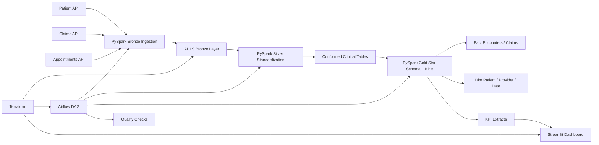

# Healthcare Data Pipeline

Recruiter-ready healthcare analytics pipeline built around the stack described in the resume entry:
Azure, PySpark, Airflow, and Streamlit.

## What This Project Demonstrates

- Azure-centered healthcare data platform with Bronze, Silver, and Gold analytics layers.
- PySpark ETL flows from source-system style healthcare APIs into curated star-schema datasets.
- Data quality enforcement for null handling, referential integrity, uniqueness, and freshness checks.
- Airflow orchestration coordinating ingestion, transformation, quality validation, and KPI publishing.
- Streamlit dashboard for non-technical and technical stakeholders to explore utilization, billing, and patient outcome KPIs.
- Terraform-managed Azure infrastructure for storage, orchestration support, secrets, and observability.
- GitHub Actions CI validating repository health and Python assets.
- A runnable local demo flow that generates curated Gold datasets and quality outputs for the dashboard.
- Azure Databricks-style orchestration payloads with configurable `dry run` behavior for local safety.

## Architecture



## Repository Layout

- `src/healthcare_data_pipeline/`: Shared Python code, PySpark-style jobs, KPI logic, and runtime config.
- `dags/`: Airflow DAG for orchestration.
- `infrastructure/terraform/`: Terraform for Azure storage, secrets, monitoring, and app hosting primitives.
- `docs/`: Architecture and deployment notes.
- `.github/workflows/`: CI checks.
- `tests/`: Unit tests covering core pipeline helpers and quality rules.
- `data/sample/bronze/`: Sample healthcare source data for a local demo pipeline run.
- `data/demo_output/`: Generated Silver, Gold, and quality outputs after running the demo pipeline.

## Implemented Stack Mapping

| Resume technology | Implemented in repo |
| --- | --- |
| Azure | ADLS Gen2-style storage, Key Vault, managed identity, role assignments, App Service, and resource group in Terraform |
| PySpark | Bronze ingestion, Silver normalization, Gold dimensional modeling, and KPI aggregation modules |
| Airflow | Daily DAG orchestrating Azure Databricks-style Bronze/Silver/Gold execution and dashboard extract publishing |
| Streamlit | Healthcare operations dashboard for encounters, claims, payer mix, and freshness status |

## Quick Start

1. Create a virtual environment and install local tooling:

   ```powershell
   python -m venv .venv
   .\.venv\Scripts\Activate.ps1
   pip install -e .[dev]
   ```

2. Copy environment variables:

   ```powershell
   Copy-Item .env.example .env
   ```

3. Run local validation:

   ```powershell
   python -m pytest
   python -m ruff check . --no-cache
   ```

4. Review Azure deployment inputs:

   ```powershell
   Copy-Item infrastructure/terraform/terraform.tfvars.example infrastructure/terraform/terraform.tfvars
   ```

5. Start the dashboard locally:

   ```powershell
   python -m healthcare_data_pipeline.demo_pipeline
   streamlit run streamlit_app.py
   ```

## Demo Run

If you want a fast local walkthrough without live Azure services:

   ```powershell
   python -m healthcare_data_pipeline.demo_pipeline
   ```

This writes generated outputs under `data/demo_output/`:

- `silver/patients.json`, `silver/claims.json`, `silver/appointments.json`
- `gold/dim_date.json`, `gold/fact_encounters.json`, `gold/kpi_metrics.json`
- `quality/quality_results.json`

The Streamlit app automatically reads those files when present.

## Local Development Notes

- Python 3.11+ is the local development baseline.
- The ETL modules are written so their transformation logic remains testable without requiring a live Spark cluster.
- The DAG uses portable Airflow operators and generates Azure Databricks `run-now` payloads.
- `AZURE_DRY_RUN=true` keeps orchestration commands safe for local preview while still showing the Azure-native execution pattern.
- The sample pipeline simulates healthcare source APIs with bundled JSON inputs, which keeps the repo runnable and interview-friendly.

## Verification

- Unit tests cover config parsing, Bronze ingestion payloads, Silver normalization, Gold mart calculations, and data quality checks.
- CI runs Python validation on every push and pull request.

## Deployment

See [Architecture Notes](docs/architecture.md) and [Deployment Guide](docs/deployment.md) for platform notes and Terraform deployment steps.
